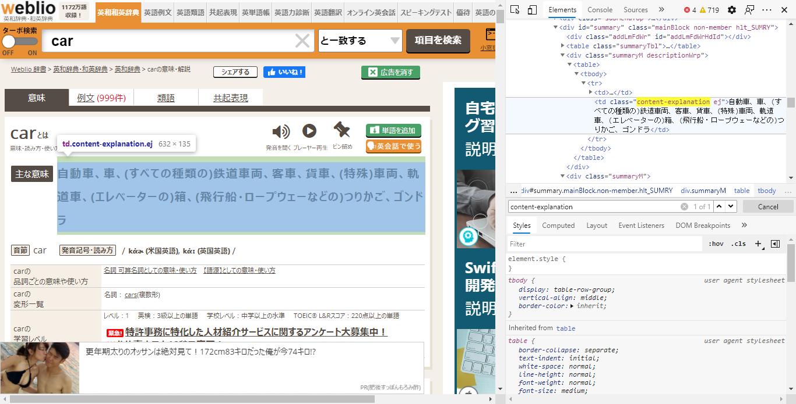

# 簡単プログラミング！ 日英単語をサクッと調べられるツールを作ってみよう

## はじめに

コマンドラインで次のようにサクッと辞書を引けたら便利じゃないですか？

今回は、ターミナルで簡単なコマンドをタイプして結果を得るCLI（コマンドラインインターフェイス）ツールを作ってみましょう。言語はGoを使用します。
また今回もコンパイル済みの実行ファイル（バイナリ）をダウンロードしてお使いになれます！

## 使い方

まずはこのコマンドの使い方を説明します。コマンド名は`weblio`です。Windows 10の方は`weblio.exe`と読み替えてください。

注）「`>`」記号はターミナルのプロンプトを表現しているのでタイプしないでください。

```shell
> weblio 調べたい単語
```


調べたい単語は英語または日本語のどちらでもOKです。ただし、日英の結果の情報は少ないです。

英語の単語を調べる

```shell
> webliogo car
```

結果

```
単語 : car
主な意味 : 自動車、車、(すべての種類の)鉄道車両、客車、貨車、(特殊)車両、軌道車、(エレベーターの)箱、(飛行船・ロープウェーなどの)つりかご、ゴンドラ
音節 : car
発音記号・読み方 : kάɚkάː
```

日本語の単語を調べる

```shell
> webliogo 車
```
結果

```
日単語 : 車
英単語 : automobile; car; wheel; vehicle
```

日英の方はこのように情報が少ないです。

では、いつものようにGIF動画を見てみましょう。


## プログラムの説明

行数が少ないのでコード全体を示します。いつもの通り、特殊な場合を除きプログラミング言語の文法自体の説明はしません。必要に応じて各自でググってください。

```go
package main

import (
	"fmt"
	"log"
	"unicode/utf8"

	"github.com/PuerkitoBio/goquery"
	"gopkg.in/alecthomas/kingpin.v2"
)

var (
	word = kingpin.Arg("word", "target word").Required().String()
)

func main() {
	kingpin.Parse()

	doc, err := goquery.NewDocument("http://ejje.weblio.jp/content/" + *word)
	if err != nil {
		log.Fatal(err)
	}
	if isIncludeMultibyte(*word) {
		fmt.Printf("日単語           : %s\n", *word)
		fmt.Printf("英単語           : %s\n", doc.Find(".content-explanation").Text())
	} else {
		fmt.Printf("単語             : %s\n", *word)
		fmt.Printf("主な意味         : %s\n", doc.Find(".content-explanation").Text())
		fmt.Printf("音節             : %s\n", doc.Find(".syllableEjje").Text())
		fmt.Printf("発音記号・読み方 : %s\n", doc.Find(".phoneticEjjeDesc").Text())
		fmt.Printf("変形一覧         : %s\n", doc.Find(".conjugateRowR").Text())
	}
}

func isIncludeMultibyte(str string) bool {
	return utf8.RuneCountInString(str) != len(str)
}

```

これだけのコード量で辞書ツールが作れるなんでナイスですね！ 改行を除けば、31行だけです。

```
===============================================================================
 Language            Files        Lines         Code     Comments       Blanks
===============================================================================
 Go                      1           37           31            0            6
===============================================================================
 Total                   1           37           31            0            6
===============================================================================
```

では、重要なポイントのみ説明します。

```go
var (
	word = kingpin.Arg("word", "target word").Required().String()
)
```

main関数が呼ばれる前に実行されます。ここでやっていることは、コマンドで指定した調べたい単語の部分を文字列として取得します。
```
> weblio car
```

上の例だと、`car`という文字列がwordという変数に格納されます。

```go
	doc, err := goquery.NewDocument("http://ejje.weblio.jp/content/" + *word)
	if err != nil {
		log.Fatal(err)
	}
```

`http://ejje.weblio.jp/content/car`にアクセスした結果を`doc`変数に格納します。何か問題があればエラーメッセージを表示してプログラムを終了します。

ブラウザで http://ejje.weblio.jp/content/car にアクセスしてみてください。`car`という単語についての情報が表示されると思います。

次にこの条件判定文をご覧ください。

```go
	if isIncludeMultibyte(*word) {
```

マルチバイトが含まれるかどうかチェックしています。つまり日本語かどうかを判定していると理解してください。
日本語だった場合と英語だった場合で、抜き取る情報を変えています。

```go
	if isIncludeMultibyte(*word) {
		fmt.Printf("日単語           : %s\n", *word)
		fmt.Printf("英単語           : %s\n", doc.Find(".content-explanation").Text())
	} else {
		fmt.Printf("単語             : %s\n", *word)
		fmt.Printf("主な意味         : %s\n", doc.Find(".content-explanation").Text())
		fmt.Printf("音節             : %s\n", doc.Find(".syllableEjje").Text())
		fmt.Printf("発音記号・読み方 : %s\n", doc.Find(".phoneticEjjeDesc").Text())
		fmt.Printf("変形一覧         : %s\n", doc.Find(".conjugateRowR").Text())
	}
```

上記を見るとなんとなくわかると思いますが、辞書検索結果を抜き取って表示しています。

```go
doc.Find(".content-explanation").Text()
```

`.content-explanation`というのは、



```html
<td class="content-explanation">
```

の部分をさしています。この部分を検索して抜き取るわけですね。まさにスクレイピング！何度も言います、サイト運営者さんありがとう！


## まとめ

いかがでしたでしょうか？

ご紹介した辞書ツールの機能を自分で実装しようとすれば、大変な労力を必要とします。
しかし、サービスを提供しているサイトの必要な機能をスクレイピングさせてもらうことで、これだけ短いコードで恩恵にあずかることができるのです。
サイトの運営者に感謝して利用させていただきましょう！

Go言語は[クロスコンパイル](https://e-words.jp/w/%E3%82%AF%E3%83%AD%E3%82%B9%E3%82%B3%E3%83%B3%E3%83%91%E3%82%A4%E3%83%AB.html)により、複数のOS用の実行可能形式のファイルを作成できます。ですので、私の場合はLinux上でクロスコンパイルし、Windows 10やmacOS（Darwin）で実行可能なバイナリファイルを作成しました。

ぜひダウンロードして使ってみてください。

クロスコンパイルの方法については、別記事で説明をしたいと思いますが、興味のある方は、本リポジトリ内の`Makefile`の内容をご覧ください。なんとなくわかるんじゃないかと思います。この`なんとなく`という感覚は開発の習慣によって得られるようになると思いますので、頑張って会得していただきたいと思います。
`なんとなく`わかるというのは、どんな業界においても通ずるものだと思います。

例としてWindows用のバイナリを作成する場合は、次のようにターミナルでタイプします。 しかし、このままタイプしてもおそらくエラーが発生すると思います。
なので、別記事で説明しますね。

```shell
> make build-windows
```

## 関連情報へのリンク

- [英和辞典・和英辞典 - Weblio辞書](https://ejje.weblio.jp/)
- [carの意味・使い方・読み方 | Weblio英和辞書](http://ejje.weblio.jp/content/car)
- [alecthomas/kingpin: CONTRIBUTIONS ONLY: A Go (golang) command line and flag parser](https://github.com/alecthomas/kingpin)
- [PuerkitoBio/goquery: A little like that j-thing, only in Go.](https://github.com/PuerkitoBio/goquery)

kingpinがほぼ更新されないようなので、代わりに次のライブラリを使ってコマンドライン引数のパースを行ってみる予定です。記事は新規に作成します。

- [alecthomas/kong: Kong is a command-line parser for Go](https://github.com/alecthomas/kong)


私がいつもGIF動画や、スクリーンショットをとるときに利用してる便利なツールです。ぜひ、お試しあれ。

- [Screenpresso：Windows用の究極のスクリーンキャプチャツール](https://www.screenpresso.com/ja/)
